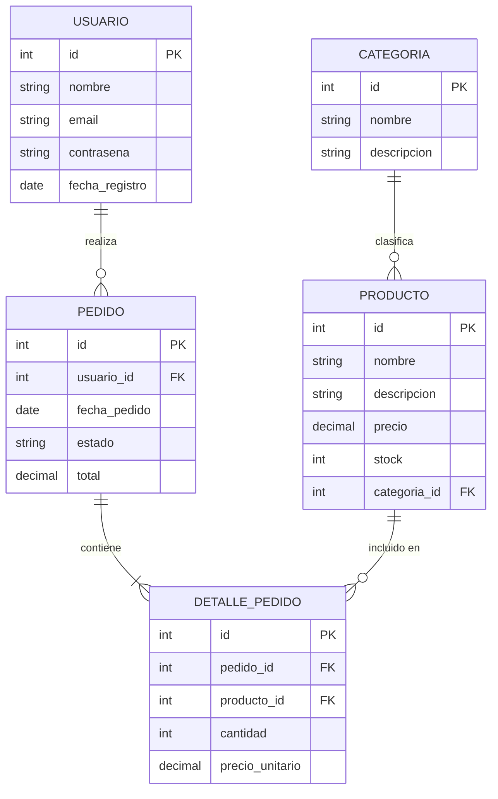

# LLL

## Diagrama de Base de Datos

```mermaid
erDiagram
    USUARIO {
        int id PK
        string nombre
        string email
        string contrasena
        date fecha_registro
    }

    CATEGORIA {
        int id PK
        string nombre
        string descripcion
    }

    PRODUCTO {
        int id PK
        string nombre
        string descripcion
        decimal precio
        int stock
        int categoria_id FK
    }

    PEDIDO {
        int id PK
        int usuario_id FK
        date fecha_pedido
        string estado
        decimal total
    }

    DETALLE_PEDIDO {
        int id PK
        int pedido_id FK
        int producto_id FK
        int cantidad
        decimal precio_unitario
    }

    USUARIO ||--o{ PEDIDO : "realiza"
    PEDIDO ||--|{ DETALLE_PEDIDO : "contiene"
    PRODUCTO ||--o{ DETALLE_PEDIDO : "incluido en"
    CATEGORIA ||--o{ PRODUCTO : "clasifica"
```
